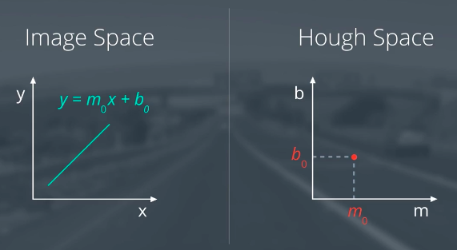
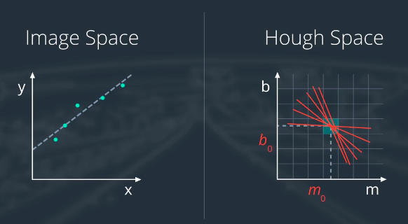
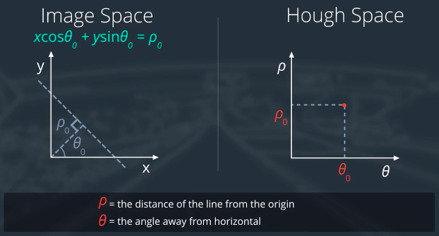

# Week 1: Welcome

1. [DARPA Grand Challenge and Stanley](https://classroom.udacity.com/nanodegrees/nd013/parts/fbf77062-5703-404e-b60c-95b78b2f3f9e/modules/83ec35ee-1e02-48a5-bdb7-d244bd47c2dc/lessons/facdff19-61a5-47e4-8179-a6a5dc28987f/concepts/70763f5c-a090-454f-aef9-8e05c16d2db5)
2. There're 2 distinct approaches to autonomous development
   - A **robotics** approach: fuses output from a suite of sensors to directly measure the vehicle surroundings and then navigate accordingly  
   - A **deep learning** approach: teach computer learn how to drive by mimicking human driving behavior        

3. Projects to build in this fantastic program

   - **Term 1: Computer vision and deep learning**  

     - Project 1: Finding lane lines
     - Project 2: Behavioral cloning
     - Project 3: Advanced lane finding and vehicle detection

   - **Term 2: Sensor fusion, localization and control** 

     - Project 4: Sensor fusion
     - Project 5: Localization
     - Project 6: Controllers

   - **Term 3: Path planning & controlling a real self-driving car**  

     - Project 7: Path planning
     - Project 8: Put your code in a real self-driving car!  

------

# Week 2: Finding Lane Lines on the Road

**[ x ] 1. what is the problem? -> [ x ] 2. color selection -> [ x ] 3. region masking -> [ x ] 4. canny edge detection -> [ x ] 5. hough transform -> [ ... ] 6. project 1**

## 0. What is Computer Vision？

Computer vision is using algorithms to let a computer see the world like we see it.

[Introduction to Computer Vision](https://cn.udacity.com/course/introduction-to-computer-vision--ud810)

## 1. What is the problem?

how to perceive the world.

camera is just like our eyes

identify and track the position of the lane lines in a series of images(video)

## 2. Color Selection

a color image is combined of 3 channels : R(ed), G(reen), B(lue).

each of these color channels contains pixels whose values range from 0(black) to 255(white).

**Always make a _COPY_ of array or images, otherwise it is just a reference**

## 3. Region Masking

region interest us

in this case, we could assume that the camera that took the image is mounted in a fixed position on the front of the car, therefore, the lane lines will always appear in the same general region of the image

## 4. Canny edge detection

This algorithm is developed by John F. Canny in 1986.

The goal of this algorithm is to identify the boundaries of an object and an image. To do this: 

1. convert to grayscale
2. compute the gradient

```python
edges = cv2.Canny(gray, low_threshold, high_threshold)

```

[Canny Edge Detector](https://docs.opencv.org/2.4/doc/tutorials/imgproc/imgtrans/canny_detector/canny_detector.html)

this function applies **Canny** to image **gray** and return outputted image **edges** low threshold and high threshold determines how strong the edges must be to be detected.

The algorithm first detect strong edge(strong gradient) pixels above the **high_threshold** and reject pixels below the **low_threshold**. Next, pixels with values between the **low_threshold** and **high_threshold** will be included as long as they are connected to strong edges. The output **edges** is a binary image with pixels tracing out the detected edges and black everywhere else.

As far as a ratio of **low_threshold** and **high_threshold**, **John F. Canny** recommended a low to high ratio of **1:2** or **1:3**.

[**Gaussian smoothing**](https://docs.opencv.org/2.4/modules/imgproc/doc/filtering.html?highlight=gaussianblur#gaussianblur)

suppress noise and spurious gradients by averaging.

you can think of the strength of an edge as being defined by how different the values are in adjecent pixels in the image, really just the strength of the gradient.

## 5. Hough transform

Paul Hough devised a method for representing lines in parameter space in 1962. Hough transform is just a conversion from image space to Hough space. The characterization of a line in image space is a single point in Hough space.



So to find lines in image space will be to look for intersecting lines in Hough space. 



Vertical lines have infinite slope in m-b representation, so we need a new parameterization. Therefore, we redefine the lines in **polar coordinates**.

```python
lines = cv2.HoughLinesP(edges, rho, theta, threshold, np.array([]), min_line_length, max_line_length)
```

**lines** will be an array containing the endpoints(x1, y1, x2, y2) of all line segments detected by the transform operation. 

**rho** and **theta** are the distance and angular resolution of the grid in Hough space. **rho** is in units of pixels and **theta** is in units of radians.

**threshold** specifies the minimum number of votes (intersections in a given grid cell) a candidate line needs to have to make it into the output. **min_line_length** is the minimum length of a line (in pixels) that you will accept in the output, and **max_line_gap** is the maximum distance (in pixels) between segments that you will allow to be connected into a single line.



## 6. Project 1: Finding Lane Lines on the Road

1. [ x ] Developement environment installation (installed Anaconda version)

2. Activate development environment 

   ```shell
   source activate carnd-term1
   jupyter notebook test.ipynb
   # source deactivate carnd-term1
   ```

   Go to **[http://localhost:8888](http://localhost:8888)** in your browser

3. [ … ] Code Review

------

# Week 4: Introduction to Neural Networks
## 14. [Gradient Descent](https://classroom.udacity.com/nanodegrees/nd013/parts/fbf77062-5703-404e-b60c-95b78b2f3f9e/modules/6df7ae49-c61c-4bb2-a23e-6527e69209ec/lessons/83a4e710-a69e-4ce9-9af9-939307c0711b/concepts/f9fc4073-7808-4018-a2e9-aa17cf239a0d)
### 1. Learning weights
Learn the weights from example data, then use those weights to make the predictions. We want to make predictions as close as possible to the real values. Therefore, we need a metric of how wrong the predictions are, the **error**. A common metric is the sum of the squared errors(SSE):
$$ E=1/2 * \sum_{u} \sum_j[]^2$$

This gives the overall error for all the output predictions for all the data points.

And the output of a neural network, the prediction, depends on the weights:
$$$$

and accordingly the error depends on the weights:
$$$$

**Our goal is to find weights $$w_{ij}$$** that minimize the squared error $$E$$.

### 2. Caveat
The weights end up where the error is low, but not the **lowest**. This spots are called **local minima**. To avoid this, there\'re some methods, such as [momentum](http://ruder.io/optimizing-gradient-descent/index.html#momentum).

### 3. Mean Square Error
$$E = 1/2 * sum_{u}(y^u - y^u)^2$$

The general algorithm for updating the weights with gradient descent:
- Set the weight step to zero: $$ delW_{i} = 0$$
- For each record in the training data:
  - Make a forward pass through the network, calculating the output $$$$
  - Calculate the error gradient in the output unit, $$$$
  - Update the weight step $$$$
- Update the weights $$$$ where $$$$ is the learning rate and $$m$$ is the number of records. Here we're averaging the weight steps to help reduce any large variations in the training data
- Repeat for $$e$$ epochs

### 4. Backpropagation
We come to the problem of how to make a multilayer neural network *learn*. To update the weights to hidden layers using gradient descent, **we need to know how much error each of the hidden units contributed to the final output**. Since the output of a layer is determined by the weights between layers, the error resulting from units is scaled by the weights going forward through the network. **Since we know the error at the output, we can use the weights to work backwards to hidden layers**.
